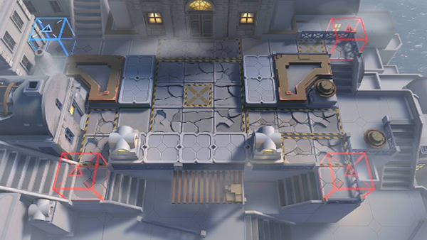

# 关卡一览————SV-EX-2

## 关卡一览

关卡编号: SV-EX-2

关卡名称: 快速失败

目标点生命值: 3

敌人总数: 42

理智消耗: 10

## 关卡地图

## 敌人情况

| 敌人图片 | 敌人名称 | 数量  |
|---------|-----|-----|
| ./eneIcons/eneIcons/¸»ÓªÑøµÄ»¬¶¯Õß.png| 富营养的滑动者  |   16  |
| ./eneIcons/eneIcons/¸»ÓªÑøµÄ¿ñ±¼Õß.png| 富营养的狂奔者  |   16  |
| ./eneIcons/eneIcons/¸»ÓªÑøµÄÅçÍÂÕß.png| 富营养的喷吐者  |   5  |
| ./eneIcons/eneIcons/¸»ÓªÑøµÄÆ®º½Õß.png| 富营养的飘航者  |   5  |
