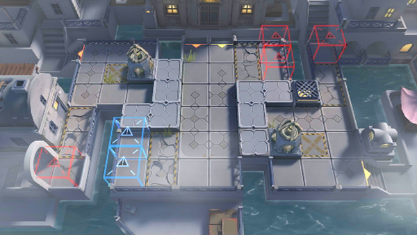

# 关卡一览————SV-EX-4

## 关卡一览

关卡编号: SV-EX-4

关卡名称: 崩溃边缘

目标点生命值: 3

敌人总数: 25

理智消耗: 15

## 关卡地图

## 敌人情况

| 敌人图片 | 敌人名称 | 数量  |
|---------|-----|-----|
| ./eneIcons/eneIcons/²§º£ÊÕ¸îÕß.png| 钵海收割者  |   2  |
| ./eneIcons/eneIcons/¸»ÓªÑøµÄ»¬¶¯Õß.png| 富营养的滑动者  |   15  |
| ./eneIcons/eneIcons/¸»ÓªÑøµÄÅÀÐÐÕß.png| 富营养的爬行者  |   2  |
| ./eneIcons/eneIcons/¸»ÓªÑøµÄÊÕ¸îÕß.png| 富营养的收割者  |   2  |
| ./eneIcons/eneIcons/×Ô¶¯Î¬»¤»úÆ÷.png| 自动维护机器  |   4  |
