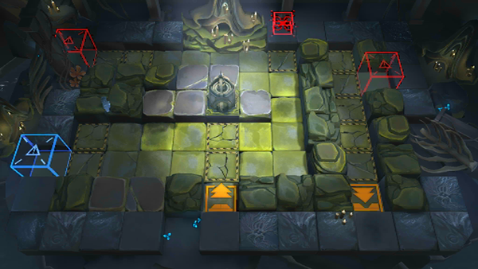

# 关卡一览————SV-EX-7

## 关卡一览

关卡编号: SV-EX-7

关卡名称: 水火不容

目标点生命值: 3

敌人总数: 34

理智消耗: 20

## 关卡地图

## 敌人情况

| 敌人图片 | 敌人名称 | 数量  |
|---------|-----|-----|
| ./eneIcons/eneIcons/¸»ÓªÑøµÄ»¬¶¯Õß.png| 富营养的滑动者  |   13  |
| ./eneIcons/eneIcons/¸»ÓªÑøµÄ¿ñ±¼Õß.png| 富营养的狂奔者  |   6  |
| ./eneIcons/eneIcons/¸»ÓªÑøµÄÅÀÐÐÕß.png| 富营养的爬行者  |   4  |
| ./eneIcons/eneIcons/¸»ÓªÑøµÄÆ®º½Õß.png| 富营养的飘航者  |   9  |
| ./eneIcons/eneIcons/Ê×ÑÔÕß.png| 首言者  |   1  |
| ./eneIcons/eneIcons/×Ô¶¯Î¬»¤»úÆ÷.png| 自动维护机器  |   1  |
