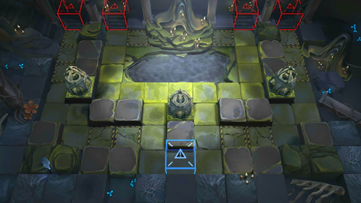

# 关卡一览————SV-EX-8

## 关卡一览

关卡编号: SV-EX-8

关卡名称: 自由意志

目标点生命值: 3

敌人总数: 39

理智消耗: 20

## 关卡地图

## 敌人情况

| 敌人图片 | 敌人名称 | 数量  |
|---------|-----|-----|
| ./eneIcons/eneIcons/¸»ÓªÑøµÄ´©´ÌÕß.png| 富营养的穿刺者  |   4  |
| ./eneIcons/eneIcons/¸»ÓªÑøµÄ»¬¶¯Õß.png| 富营养的滑动者  |   15  |
| ./eneIcons/eneIcons/¸»ÓªÑøµÄÅÀÐÐÕß.png| 富营养的爬行者  |   4  |
| ./eneIcons/eneIcons/¸»ÓªÑøµÄÅçÍÂÕß.png| 富营养的喷吐者  |   4  |
| ./eneIcons/eneIcons/¿Çº£¿ñ±¼Õß.png| 壳海狂奔者  |   10  |
| ./eneIcons/eneIcons/ÑηçÖ÷½ÌÀ¥Í¼Ë¹.png| 盐风主教昆图斯  |   1  |
| ./eneIcons/eneIcons/×Ô¶¯Î¬»¤»úÆ÷.png| 自动维护机器  |   1  |
