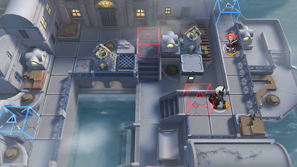

# 关卡一览————SV-TR-1

## 关卡一览

关卡编号: SV-TR-1

关卡名称: 疼痛增幅

目标点生命值: 5

敌人总数: 6

理智消耗: 0

## 关卡地图

## 敌人情况

| 敌人图片 | 敌人名称 | 数量  |
|---------|-----|-----|
| ./eneIcons/eneIcons/µ×º£»¬¶¯Õß.png| 底海滑动者  |   6  |
