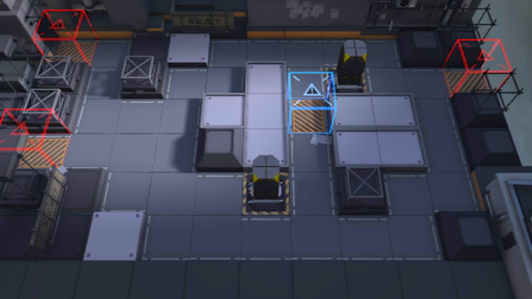

# 关卡一览————SW-EV-1

## 关卡一览

关卡编号: SW-EV-1

关卡名称: 引爆

目标点生命值: 3

敌人总数: 37

理智消耗: 6

## 关卡地图

## 敌人情况

| 敌人图片 | 敌人名称 | 数量  |
|---------|-----|-----|
| ./eneIcons/eneIcons/ÁÔ¹·pro.png| 猎狗pro  |   5  |
| ./eneIcons/eneIcons/ȼÉÕƿͶÖÀÕß.png| 燃烧瓶投掷者  |   7  |
| ./eneIcons/eneIcons/Ê°»ÄÕß.png| 拾荒者  |   4  |
| ./eneIcons/eneIcons/Ê¿±ø.png| 士兵  |   14  |
| ./eneIcons/eneIcons/Ë«³Ö½£Ê¿.png| 双持剑士  |   7  |
