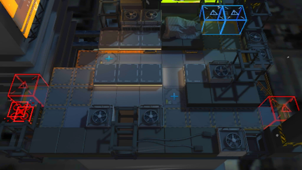

# 关卡一览————SW-EV-2

## 关卡一览

关卡编号: SW-EV-2

关卡名称: 聚集

目标点生命值: 3

敌人总数: 41

理智消耗: 9

## 关卡地图

## 敌人情况

| 敌人图片 | 敌人名称 | 数量  |
|---------|-----|-----|
| ./eneIcons/eneIcons/¸ß½×Êõʦ.png| 高阶术师  |   3  |
| ./eneIcons/eneIcons/¿Õ½µ±ø.png| 空降兵  |   8  |
| ./eneIcons/eneIcons/ÅÍз.png| 磐蟹  |   10  |
| ./eneIcons/eneIcons/Çá¼×ÎÀ±ø.png| 轻甲卫兵  |   15  |
| ./eneIcons/eneIcons/Óù4.png| 御4  |   3  |
| ./eneIcons/eneIcons/ÖØ×°·ÀÓùÕß.png| 重装防御者  |   2  |
