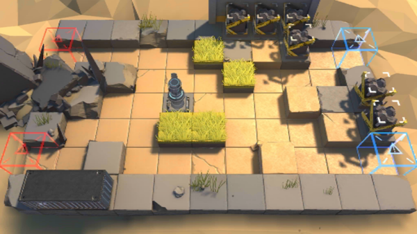

# 关卡一览————SW-EV-3

## 关卡一览

关卡编号: SW-EV-3

关卡名称: 斑驳

目标点生命值: 3

敌人总数: 44

理智消耗: 12

## 关卡地图

## 敌人情况

| 敌人图片 | 敌人名称 | 数量  |
|---------|-----|-----|
| ./eneIcons/eneIcons/¼¼ÊõÕì²ì±ø.png| 技术侦察兵  |   2  |
| ./eneIcons/eneIcons/¿ñ±©µÄÁÔ¹·pro.png| 狂暴的猎狗pro  |   4  |
| ./eneIcons/eneIcons/DZ·üÕß.png| 潜伏者  |   21  |
| ./eneIcons/eneIcons/ÍÀÔ×ÀÏÊÖ.png| 屠宰老手  |   3  |
| ./eneIcons/eneIcons/ÒþÐÎåóÊÖ.png| 隐形弩手  |   6  |
| ./eneIcons/eneIcons/ÒþÐÎÊõʦ.png| 隐形术师  |   8  |
