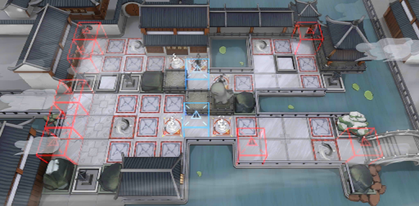

# 关卡一览————TB-10

## 关卡一览

关卡编号: TB-10

关卡名称: 半价古董店

目标点生命值: 3

敌人总数: 22

理智消耗: 0

## 关卡地图

## 敌人情况

| 敌人图片 | 敌人名称 | 数量  |
|---------|-----|-----|
| ./eneIcons/eneIcons/¡°°¢Ò§¡±.png| “阿咬”  |   2  |
| ./eneIcons/eneIcons/¡°ÕÚÄ¿¡±.png| “遮目”  |   9  |
| ./eneIcons/eneIcons/»Ð㱵ġ°µÃÒ⡱.png| 恍惚的“得意”  |   11  |
