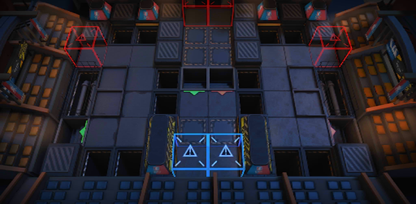

# 关卡一览————TB-3

## 关卡一览

关卡编号: TB-3

关卡名称: 沸腾俱乐部

目标点生命值: 3

敌人总数: 30

理智消耗: 12

## 关卡地图

## 敌人情况

| 敌人图片 | 敌人名称 | 数量  |
|---------|-----|-----|
| ./eneIcons/eneIcons/·ÐѪÆïÊ¿Íž«Èñ.png| 沸血骑士团精锐  |   3  |
| ./eneIcons/eneIcons/·ÐѪÆïÊ¿ÍÅѧͽ.png| 沸血骑士团学徒  |   6  |
| ./eneIcons/eneIcons/ÎÞÃû¶ÀÁ¢ÆïÊ¿.png| 无名独立骑士  |   16  |
| ./eneIcons/eneIcons/ѵÁ·Óòб©Ç¯ÊÞ.png| 训练用残暴钳兽  |   5  |
