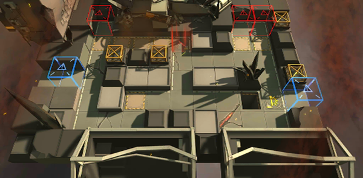

# 关卡一览————TB-4

## 关卡一览

关卡编号: TB-4

关卡名称: 流寇帮

目标点生命值: 3

敌人总数: 32

理智消耗: 12

## 关卡地图

## 敌人情况

| 敌人图片 | 敌人名称 | 数量  |
|---------|-----|-----|
| ./eneIcons/eneIcons/·ÛËé¹¥¼áÊÖ.png| 粉碎攻坚手  |   2  |
| ./eneIcons/eneIcons/·ÛËé¹¥¼á×鳤.png| 粉碎攻坚组长  |   1  |
| ./eneIcons/eneIcons/¸´³ðÕß.png| 复仇者  |   3  |
| ./eneIcons/eneIcons/ÎÚÈø˹¸ß¼¶Í»Ï®åóÊÖ.png| 乌萨斯高级突袭弩手  |   4  |
| ./eneIcons/eneIcons/ÎÚÈø˹ÁÑÊÞ.png| 乌萨斯裂兽  |   15  |
| ./eneIcons/eneIcons/ÎÚÈø˹ͻ»÷Õß.png| 乌萨斯突击者  |   3  |
| ./eneIcons/eneIcons/Ñ°³ðÕß.png| 寻仇者  |   2  |
| ./eneIcons/eneIcons/ÔÞÖúÎÞÈË»ú.png| 赞助无人机  |   2  |
