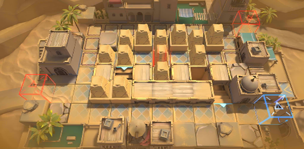

# 关卡一览————TB-5

## 关卡一览

关卡编号: TB-5

关卡名称: 排骨汤巷

目标点生命值: 3

敌人总数: 34

理智消耗: 15

## 关卡地图

## 敌人情况

| 敌人图片 | 敌人名称 | 数量  |
|---------|-----|-----|
| ./eneIcons/eneIcons/Èø¿¨×È°Ù·ò³¤.png| 萨卡兹百夫长  |   2  |
| ./eneIcons/eneIcons/Èø¿¨×ȵ¶Êõʦ.png| 萨卡兹刀术师  |   26  |
| ./eneIcons/eneIcons/Èø¿¨×Èħ½£Ê¿.png| 萨卡兹魔剑士  |   4  |
| ./eneIcons/eneIcons/Èø¿¨×ÈÉÚ±ø.png| 萨卡兹哨兵  |   2  |
