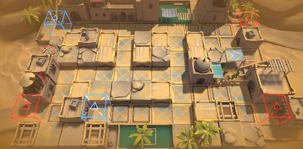

# 关卡一览————TB-6

## 关卡一览

关卡编号: TB-6

关卡名称: 贝西林商会

目标点生命值: 3

敌人总数: 36

理智消耗: 15

## 关卡地图

## 敌人情况

| 敌人图片 | 敌人名称 | 数量  |
|---------|-----|-----|
| ./eneIcons/eneIcons/·´×°¼×²½±ø.png| 反装甲步兵  |   12  |
| ./eneIcons/eneIcons/ÆÆƬUÐÍ.png| 破片U型  |   0  |
| ./eneIcons/eneIcons/ÇãÔþÕß.png| 倾轧者  |   6  |
| ./eneIcons/eneIcons/Õ½ÊõÁÔÈ®pro.png| 战术猎犬pro  |   12  |
| ./eneIcons/eneIcons/Õ½ÊõåóÊÖ×鳤.png| 战术弩手组长  |   6  |
