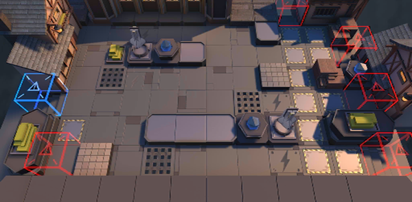

# 关卡一览————TB-8

## 关卡一览

关卡编号: TB-8

关卡名称: 塔西会

目标点生命值: 3

敌人总数: 40

理智消耗: 21

## 关卡地图

## 敌人情况

| 敌人图片 | 敌人名称 | 数量  |
|---------|-----|-----|
| ./eneIcons/eneIcons/¶¬ÁéѪÎ×.png| 冬灵血巫  |   9  |
| ./eneIcons/eneIcons/À³ËþÄáÑÇÅѱø.png| 莱塔尼亚叛兵  |   5  |
| ./eneIcons/eneIcons/À³ËþÄáÑÇÇáÓïÕß.png| 莱塔尼亚轻语者  |   11  |
| ./eneIcons/eneIcons/ÄàÑÒС¶Ó¼ùÐÐÕß.png| 泥岩小队践行者  |   5  |
| ./eneIcons/eneIcons/ÄàÑÒС¶ÓÖÀÄÜÕß.png| 泥岩小队掷能者  |   8  |
| ./eneIcons/eneIcons/Î×Êõ¾ÞÏñ.png| 巫术巨像  |   2  |
