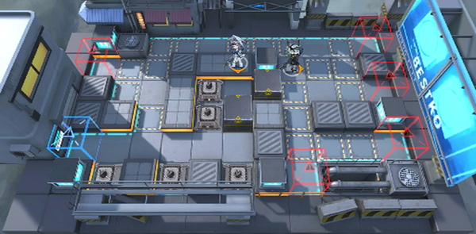

# 关卡一览————TB-9

## 关卡一览

关卡编号: TB-9

关卡名称: 白房子酒吧

目标点生命值: 3

敌人总数: 51

理智消耗: 0

## 关卡地图

## 敌人情况

| 敌人图片 | 敌人名称 | 数量  |
|---------|-----|-----|
| ./eneIcons/eneIcons/»ÒβÏãÖ÷.png| 灰尾香主  |   6  |
| ./eneIcons/eneIcons/¾«ÈñÎ÷Î÷ÀïÈË.png| 精锐西西里人  |   23  |
| ./eneIcons/eneIcons/ÇãÔþÕß.png| 倾轧者  |   3  |
| ./eneIcons/eneIcons/ȼÉÕƿͶÖÀÕß.png| 燃烧瓶投掷者  |   14  |
| ./eneIcons/eneIcons/Éî³Ø·Ù»ÙÕ߶ӳ¤.png| 深池焚毁者队长  |   3  |
| ./eneIcons/eneIcons/Éî³ØËÜÄÜÊõʦ.png| 深池塑能术师  |   2  |
