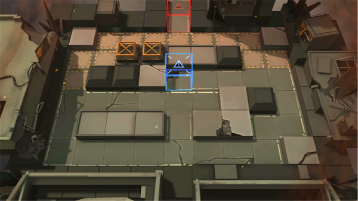

# 关卡一览————TB-DB-1

## 关卡一览

关卡编号: TB-DB-1

关卡名称: 拂晓之处-认识

目标点生命值: 5

敌人总数: 32

理智消耗: 10

## 关卡地图

## 敌人情况

| 敌人图片 | 敌人名称 | 数量  |
|---------|-----|-----|
| ./eneIcons/eneIcons/»ú¶¯¶Ü±ø.png| 机动盾兵  |   7  |
| ./eneIcons/eneIcons/Ê°»ÄÕß.png| 拾荒者  |   6  |
| ./eneIcons/eneIcons/Ê¿±ø.png| 士兵  |   9  |
| ./eneIcons/eneIcons/Դʯ³æ.png| 源石虫  |   10  |
