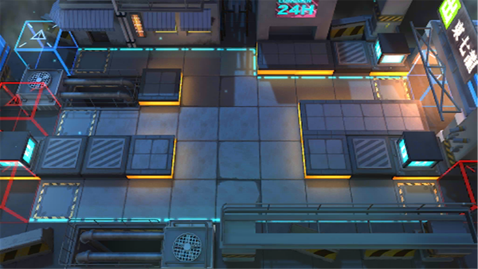

# 关卡一览————TB-DB-3

## 关卡一览

关卡编号: TB-DB-3

关卡名称: 拂晓之处-感官

目标点生命值: 3

敌人总数: 46

理智消耗: 10

## 关卡地图

## 敌人情况

| 敌人图片 | 敌人名称 | 数量  |
|---------|-----|-----|
| ./eneIcons/eneIcons/±©Í½.png| 暴徒  |   14  |
| ./eneIcons/eneIcons/Ê°»ÄÕß.png| 拾荒者  |   4  |
| ./eneIcons/eneIcons/Ê¿±ø.png| 士兵  |   14  |
| ./eneIcons/eneIcons/ÓÄÁé.png| 幽灵  |   14  |
