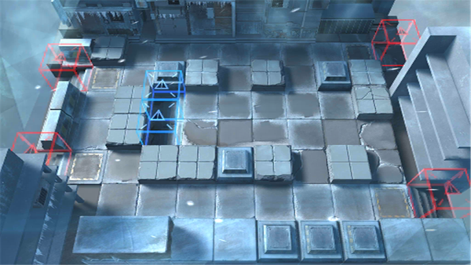

# 关卡一览————TB-DB-4

## 关卡一览

关卡编号: TB-DB-4

关卡名称: 拂晓之处-物性

目标点生命值: 3

敌人总数: 51

理智消耗: 10

## 关卡地图

## 敌人情况

| 敌人图片 | 敌人名称 | 数量  |
|---------|-----|-----|
| ./eneIcons/eneIcons/±ù±¬Ô´Ê¯³æ.png| 冰爆源石虫  |   6  |
| ./eneIcons/eneIcons/Ê¿±ø.png| 士兵  |   22  |
| ./eneIcons/eneIcons/Ñ©¹Ö¾Ñ»÷ÊÖ.png| 雪怪狙击手  |   5  |
| ./eneIcons/eneIcons/Ñ©¹ÖÊõʦ.png| 雪怪术师  |   4  |
| ./eneIcons/eneIcons/Ñ©¹ÖС¶Ó.png| 雪怪小队  |   14  |
