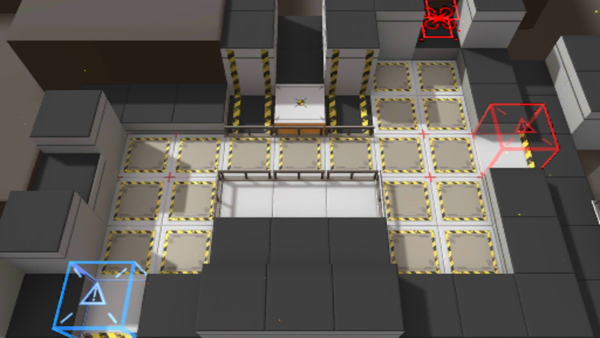

# 关卡一览————TR-10

## 关卡一览

关卡编号: TR-10

关卡名称: 小队防御

目标点生命值: 1

敌人总数: 4

理智消耗: 0

## 关卡地图

## 敌人情况

| 敌人图片 | 敌人名称 | 数量  |
|---------|-----|-----|
| ./eneIcons/eneIcons/ȼÉÕƿͶÖÀÕß.png| 燃烧瓶投掷者  |   2  |
| ./eneIcons/eneIcons/Ñý¹Ö.png| 妖怪  |   2  |
