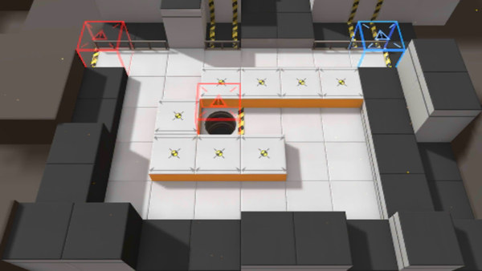

# 关卡一览————TR-11

## 关卡一览

关卡编号: TR-11

关卡名称: 战术阻滞

目标点生命值: 1

敌人总数: 14

理智消耗: 0

## 关卡地图

## 敌人情况

| 敌人图片 | 敌人名称 | 数量  |
|---------|-----|-----|
| ./eneIcons/eneIcons/Դʯ³æ¡¤¦Á.png| 源石虫·α  |   12  |
| ./eneIcons/eneIcons/ÖØ×°·ÀÓùÕß.png| 重装防御者  |   2  |
