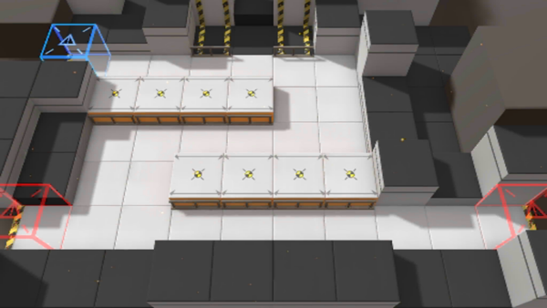

# 关卡一览————TR-13

## 关卡一览

关卡编号: TR-13

关卡名称: 先发制人

目标点生命值: 1

敌人总数: 16

理智消耗: 0

## 关卡地图

## 敌人情况

| 敌人图片 | 敌人名称 | 数量  |
|---------|-----|-----|
| ./eneIcons/eneIcons/¸ß½×Êõʦ.png| 高阶术师  |   1  |
| ./eneIcons/eneIcons/ÁÔ¹·.png| 猎狗  |   5  |
| ./eneIcons/eneIcons/Ê¿±ø.png| 士兵  |   3  |
| ./eneIcons/eneIcons/Դʯ³æ¡¤¦Á.png| 源石虫·α  |   7  |
