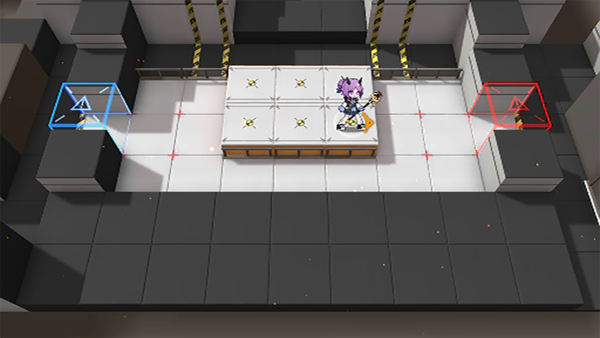

# 关卡一览————TR-16

## 关卡一览

关卡编号: TR-16

关卡名称: 恶劣环境

目标点生命值: 3

敌人总数: 2

理智消耗: 0

## 关卡地图

## 敌人情况

| 敌人图片 | 敌人名称 | 数量  |
|---------|-----|-----|
| ./eneIcons/eneIcons/Ñ©¹ÖÊõʦ.png| 雪怪术师  |   1  |
| ./eneIcons/eneIcons/Ñ©¹ÖÊõʦ×鳤.png| 雪怪术师组长  |   1  |
