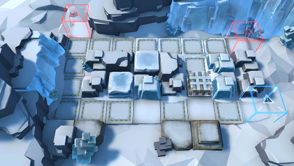

# 关卡一览————TR-18

## 关卡一览

关卡编号: TR-18

关卡名称: 疏散平民

目标点生命值: 3

敌人总数: 7

理智消耗: 0

## 关卡地图

## 敌人情况

| 敌人图片 | 敌人名称 | 数量  |
|---------|-----|-----|
| ./eneIcons/eneIcons/¸ÐȾÕß¾À²ì¹Ù.png| 感染者纠察官  |   3  |
| ./eneIcons/eneIcons/ÎÚÈø˹ÁÑÊÞ.png| 乌萨斯裂兽  |   2  |
| ./eneIcons/eneIcons/ÎÚÈø˹ƽÃñ.png| 乌萨斯平民  |   2  |
