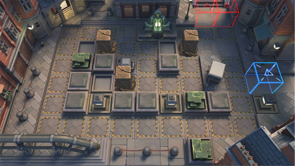

# 关卡一览————TR-19

## 关卡一览

关卡编号: TR-19

关卡名称: 废墟行动

目标点生命值: 5

敌人总数: 11

理智消耗: 0

## 关卡地图

## 敌人情况

| 敌人图片 | 敌人名称 | 数量  |
|---------|-----|-----|
| ./eneIcons/eneIcons/Éî³ØÕì²ì±ø.png| 深池侦察兵  |   4  |
| ./eneIcons/eneIcons/Éî³ØÕì²ìÈ®.png| 深池侦察犬  |   7  |
