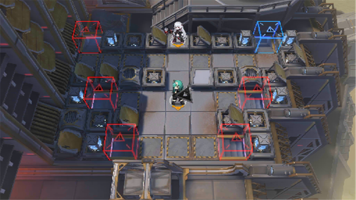

# 关卡一览————TR-20

## 关卡一览

关卡编号: TR-20

关卡名称: 城墙之下

目标点生命值: 15

敌人总数: 20

理智消耗: 0

## 关卡地图

## 敌人情况

| 敌人图片 | 敌人名称 | 数量  |
|---------|-----|-----|
| ./eneIcons/eneIcons/´ó¾ýÖ®´¥.png| 大君之触  |   12  |
| ./eneIcons/eneIcons/Èø¿¨×È×ÓÒṤ½³.png| 萨卡兹子裔工匠  |   2  |
| ./eneIcons/eneIcons/Èø¿¨×È×ÓÒáսʿ.png| 萨卡兹子裔战士  |   6  |
