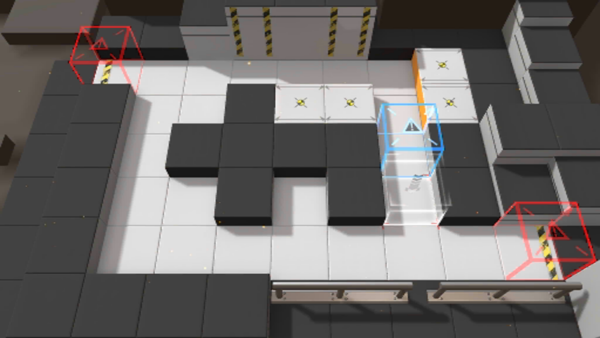

# 关卡一览————TR-8

## 关卡一览

关卡编号: TR-8

关卡名称: 障碍设置

目标点生命值: 1

敌人总数: 9

理智消耗: 0

## 关卡地图

## 敌人情况

| 敌人图片 | 敌人名称 | 数量  |
|---------|-----|-----|
| ./eneIcons/eneIcons/Ê¿±ø.png| 士兵  |   5  |
| ./eneIcons/eneIcons/Դʯ³æ.png| 源石虫  |   4  |
