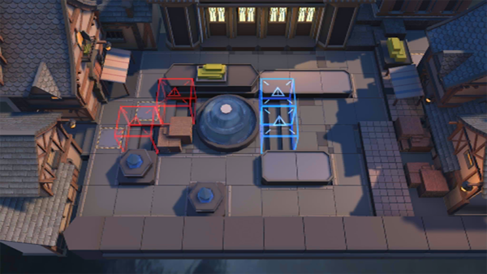

# 关卡一览————TW-1

## 关卡一览

关卡编号: TW-1

关卡名称: 缄默不言

目标点生命值: 5

敌人总数: 40

理智消耗: 9

## 关卡地图

## 敌人情况

| 敌人图片 | 敌人名称 | 数量  |
|---------|-----|-----|
| ./eneIcons/eneIcons/»ú¶¯ÎÀ±ø.png| 机动卫兵  |   3  |
| ./eneIcons/eneIcons/À³ËþÄáÑÇÅѱø.png| 莱塔尼亚叛兵  |   10  |
| ./eneIcons/eneIcons/Դʯ³æ.png| 源石虫  |   16  |
| ./eneIcons/eneIcons/Դʯ³æ¡¤¦Á.png| 源石虫·α  |   11  |
