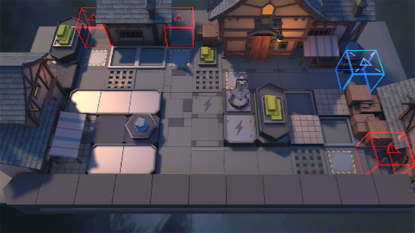

# 关卡一览————TW-3

## 关卡一览

关卡编号: TW-3

关卡名称: 高塔烟火

目标点生命值: 3

敌人总数: 32

理智消耗: 12

## 关卡地图

## 敌人情况

| 敌人图片 | 敌人名称 | 数量  |
|---------|-----|-----|
| ./eneIcons/eneIcons/¶¬ÁéÁÔÈ®.png| 冬灵猎犬  |   4  |
| ./eneIcons/eneIcons/À³ËþÄáÑÇÅѱø.png| 莱塔尼亚叛兵  |   20  |
| ./eneIcons/eneIcons/À³ËþÄáÑÇÇáÓïÕß.png| 莱塔尼亚轻语者  |   4  |
| ./eneIcons/eneIcons/ÖØ×°·ÀÓùÕß-NÐÍ.png| 重装防御者-N型  |   4  |
