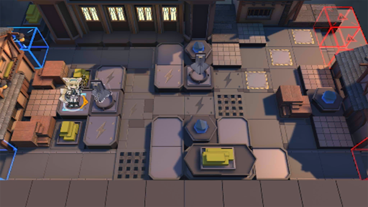

# 关卡一览————TW-4

## 关卡一览

关卡编号: TW-4

关卡名称: 复仇之魂

目标点生命值: 3

敌人总数: 34

理智消耗: 12

## 关卡地图

## 敌人情况

| 敌人图片 | 敌人名称 | 数量  |
|---------|-----|-----|
| ./eneIcons/eneIcons/¶¬ÁéÁÔÈ®.png| 冬灵猎犬  |   11  |
| ./eneIcons/eneIcons/¶¬ÁéѪÎ×.png| 冬灵血巫  |   3  |
| ./eneIcons/eneIcons/À³ËþÄáÑÇÅѱø.png| 莱塔尼亚叛兵  |   17  |
| ./eneIcons/eneIcons/À³ËþÄáÑÇÇáÓïÕß.png| 莱塔尼亚轻语者  |   3  |
