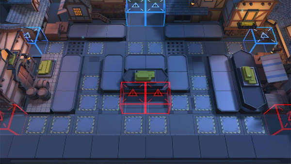

# 关卡一览————TW-5

## 关卡一览

关卡编号: TW-5

关卡名称: 冬灵挽歌

目标点生命值: 3

敌人总数: 30

理智消耗: 15

## 关卡地图

## 敌人情况

| 敌人图片 | 敌人名称 | 数量  |
|---------|-----|-----|
| ./eneIcons/eneIcons/±àÖÆÊõʦ×鳤.png| 编制术师组长  |   4  |
| ./eneIcons/eneIcons/À³ËþÄáÑÇÅѱø.png| 莱塔尼亚叛兵  |   20  |
| ./eneIcons/eneIcons/À³ËþÄáÑÇÇáÓïÕß.png| 莱塔尼亚轻语者  |   5  |
| ./eneIcons/eneIcons/ÄàÑÒС¶Ó¼ùÐÐÕß.png| 泥岩小队践行者  |   1  |
