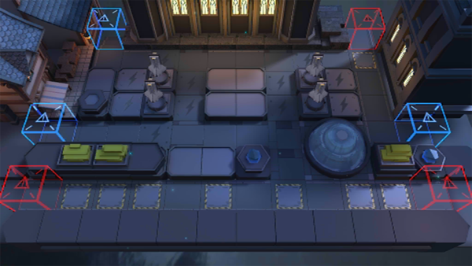

# 关卡一览————TW-8

## 关卡一览

关卡编号: TW-8

关卡名称: 月光沉沦

目标点生命值: 3

敌人总数: 41

理智消耗: 18

## 关卡地图

## 敌人情况

| 敌人图片 | 敌人名称 | 数量  |
|---------|-----|-----|
| ./eneIcons/eneIcons/À³ËþÄáÑÇÅѱø.png| 莱塔尼亚叛兵  |   20  |
| ./eneIcons/eneIcons/À³ËþÄáÑÇÇáÓïÕß.png| 莱塔尼亚轻语者  |   5  |
| ./eneIcons/eneIcons/ÄàÑÒ(µÐ·½).png| 泥岩(敌方)  |   1  |
| ./eneIcons/eneIcons/ÄàÑÒ¾ÞÏñ.png| 泥岩巨像  |   2  |
| ./eneIcons/eneIcons/ÄàÑÒС¶Ó¼ùÐÐÕß.png| 泥岩小队践行者  |   7  |
| ./eneIcons/eneIcons/ÄàÑÒС¶ÓÖÀÄÜÕß.png| 泥岩小队掷能者  |   6  |
