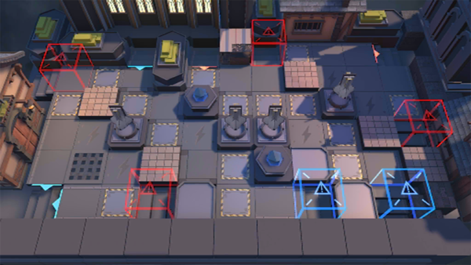

# 关卡一览————TW-EX-4

## 关卡一览

关卡编号: TW-EX-4

关卡名称: 旋律阵线

目标点生命值: 3

敌人总数: 52

理智消耗: 15

## 关卡地图

## 敌人情况

| 敌人图片 | 敌人名称 | 数量  |
|---------|-----|-----|
| ./eneIcons/eneIcons/À³ËþÄáÑÇÅѱø.png| 莱塔尼亚叛兵  |   34  |
| ./eneIcons/eneIcons/À³ËþÄáÑÇÇáÓïÕß.png| 莱塔尼亚轻语者  |   4  |
| ./eneIcons/eneIcons/À³ËþÄáÑÇÒ÷³ªÕß.png| 莱塔尼亚吟唱者  |   4  |
| ./eneIcons/eneIcons/ÄàÑÒ¾ÞÏñ.png| 泥岩巨像  |   2  |
| ./eneIcons/eneIcons/ÄàÑÒС¶Ó¼ùÐÐÕß.png| 泥岩小队践行者  |   2  |
| ./eneIcons/eneIcons/ÄàÑÒС¶ÓÖÀÄÜÕß.png| 泥岩小队掷能者  |   6  |
