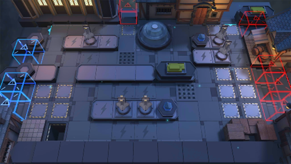

# 关卡一览————TW-MO-1

## 关卡一览

关卡编号: TW-MO-1

关卡名称: 沃伦姆德

目标点生命值: 10

敌人总数: 200

理智消耗: 25

## 关卡地图

## 敌人情况

| 敌人图片 | 敌人名称 | 数量  |
|---------|-----|-----|
| ./eneIcons/eneIcons/¶¬ÁéÁÔÈ®.png| 冬灵猎犬  |   8  |
| ./eneIcons/eneIcons/¶¬ÁéÁÔÈ®pro.png| 冬灵猎犬pro  |   27  |
| ./eneIcons/eneIcons/¶¬ÁéѪÎ×.png| 冬灵血巫  |   3  |
| ./eneIcons/eneIcons/¶¬ÁéѪÎ×´óʦ.png| 冬灵血巫大师  |   4  |
| ./eneIcons/eneIcons/À³ËþÄáÑÇÅѱø.png| 莱塔尼亚叛兵  |   6  |
| ./eneIcons/eneIcons/À³ËþÄáÑÇÅѱø×鳤.png| 莱塔尼亚叛兵组长  |   74  |
| ./eneIcons/eneIcons/À³ËþÄáÑÇÇáÓïÕß.png| 莱塔尼亚轻语者  |   14  |
| ./eneIcons/eneIcons/À³ËþÄáÑÇÒ÷³ªÕß.png| 莱塔尼亚吟唱者  |   19  |
| ./eneIcons/eneIcons/ÄàÑÒ¾ÞÏñ.png| 泥岩巨像  |   1  |
| ./eneIcons/eneIcons/ÄàÑÒС¶Ó¼ùÐÐÕß.png| 泥岩小队践行者  |   11  |
| ./eneIcons/eneIcons/ÄàÑÒС¶Ó¼ùÐÐÕß×鳤.png| 泥岩小队践行者组长  |   16  |
| ./eneIcons/eneIcons/ÄàÑÒС¶ÓÖÀÄÜÕß.png| 泥岩小队掷能者  |   4  |
| ./eneIcons/eneIcons/ÄàÑÒС¶ÓÖÀÄÜÕß×鳤.png| 泥岩小队掷能者组长  |   8  |
| ./eneIcons/eneIcons/Î×Êõ¾ÞÏñ.png| 巫术巨像  |   5  |
