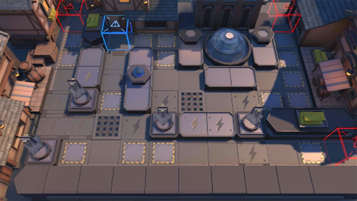

# 关卡一览————TW-S-1

## 关卡一览

关卡编号: TW-S-1

关卡名称: 三座巨像

目标点生命值: 3

敌人总数: 43

理智消耗: 15

## 关卡地图

## 敌人情况

| 敌人图片 | 敌人名称 | 数量  |
|---------|-----|-----|
| ./eneIcons/eneIcons/¶¬ÁéѪÎ×.png| 冬灵血巫  |   2  |
| ./eneIcons/eneIcons/¶¬ÁéѪÎ×´óʦ.png| 冬灵血巫大师  |   1  |
| ./eneIcons/eneIcons/À³ËþÄáÑÇÅѱø×鳤.png| 莱塔尼亚叛兵组长  |   20  |
| ./eneIcons/eneIcons/À³ËþÄáÑÇÇáÓïÕß.png| 莱塔尼亚轻语者  |   15  |
| ./eneIcons/eneIcons/ÄàÑÒ¾ÞÏñ.png| 泥岩巨像  |   3  |
| ./eneIcons/eneIcons/ÄàÑÒС¶Ó¼ùÐÐÕß.png| 泥岩小队践行者  |   2  |
