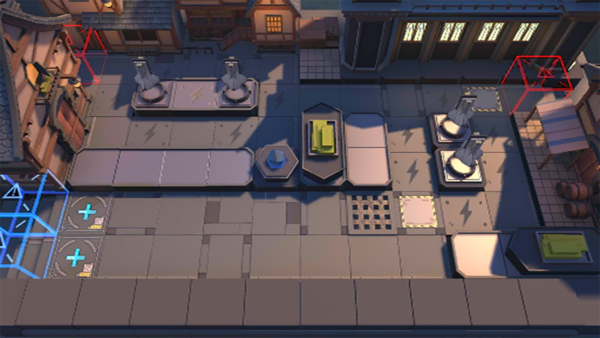

# 关卡一览————TW-S-2

## 关卡一览

关卡编号: TW-S-2

关卡名称: 一束哀悼

目标点生命值: 3

敌人总数: 37

理智消耗: 15

## 关卡地图

## 敌人情况

| 敌人图片 | 敌人名称 | 数量  |
|---------|-----|-----|
| ./eneIcons/eneIcons/¶¬ÁéÁÔÈ®pro.png| 冬灵猎犬pro  |   8  |
| ./eneIcons/eneIcons/À³ËþÄáÑÇÅѱø×鳤.png| 莱塔尼亚叛兵组长  |   15  |
| ./eneIcons/eneIcons/ÄàÑÒ(µÐ·½).png| 泥岩(敌方)  |   1  |
| ./eneIcons/eneIcons/ÄàÑÒС¶Ó¼ùÐÐÕß×鳤.png| 泥岩小队践行者组长  |   5  |
| ./eneIcons/eneIcons/ÄàÑÒС¶ÓÖÀÄÜÕß×鳤.png| 泥岩小队掷能者组长  |   4  |
| ./eneIcons/eneIcons/Î×Êõ¾ÞÏñ.png| 巫术巨像  |   4  |
