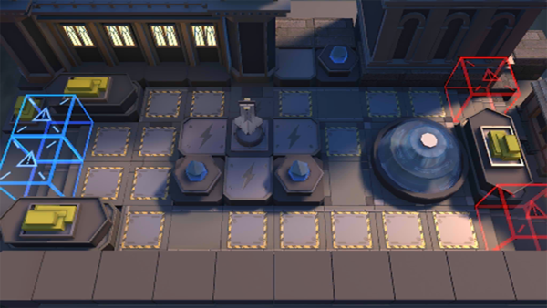

# 关卡一览————TW-TR-1

## 关卡一览

关卡编号: TW-TR-1

关卡名称: 争夺装置

目标点生命值: 5

敌人总数: 9

理智消耗: 0

## 关卡地图

## 敌人情况

| 敌人图片 | 敌人名称 | 数量  |
|---------|-----|-----|
| ./eneIcons/eneIcons/¶¬ÁéÁÔÈ®.png| 冬灵猎犬  |   2  |
| ./eneIcons/eneIcons/À³ËþÄáÑÇÅѱø.png| 莱塔尼亚叛兵  |   5  |
| ./eneIcons/eneIcons/À³ËþÄáÑÇÇáÓïÕß.png| 莱塔尼亚轻语者  |   2  |
