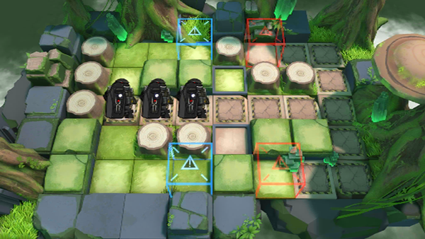

# 关卡一览————VI-1

## 关卡一览

关卡编号: VI-1

关卡名称: 侧面作战

目标点生命值: 5

敌人总数: 24

理智消耗: 6

## 关卡地图

## 敌人情况

| 敌人图片 | 敌人名称 | 数量  |
|---------|-----|-----|
| ./eneIcons/eneIcons/ÌáÑÇ¿¨ÎÚ¹Ú¾ü.png| 提亚卡乌冠军  |   2  |
| ./eneIcons/eneIcons/ÌáÑÇ¿¨ÎÚºÃÕ½Õß.png| 提亚卡乌好战者  |   10  |
| ./eneIcons/eneIcons/ÌáÑÇ¿¨ÎÚսʿ.png| 提亚卡乌战士  |   12  |
