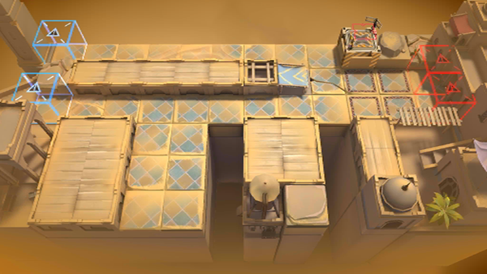

# 关卡一览————VI-2

## 关卡一览

关卡编号: VI-2

关卡名称: 从天而降

目标点生命值: 3

敌人总数: 39

理智消耗: 6

## 关卡地图

## 敌人情况

| 敌人图片 | 敌人名称 | 数量  |
|---------|-----|-----|
| ./eneIcons/eneIcons/¿Õ½µ±ø.png| 空降兵  |   20  |
| ./eneIcons/eneIcons/ÆÆƬ.png| 破片  |   0  |
| ./eneIcons/eneIcons/ÌúÕè.png| 铁砧  |   0  |
| ./eneIcons/eneIcons/Õ½Êõ·ÀÓùÕß.png| 战术防御者  |   2  |
| ./eneIcons/eneIcons/Õ½ÊõÁÔÈ®.png| 战术猎犬  |   6  |
| ./eneIcons/eneIcons/Õ½ÊõåóÊÖ.png| 战术弩手  |   10  |
| ./eneIcons/eneIcons/Õ½ÕùÓÄÁé.png| 战争幽灵  |   1  |
