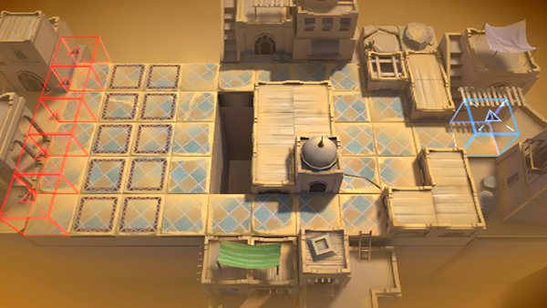

# 关卡一览————VI-3

## 关卡一览

关卡编号: VI-3

关卡名称: 亲子聚会

目标点生命值: 3

敌人总数: 49

理智消耗: 9

## 关卡地图

## 敌人情况

| 敌人图片 | 敌人名称 | 数量  |
|---------|-----|-----|
| ./eneIcons/eneIcons/±äÒìÑÒÖë.png| 变异岩蛛  |   15  |
| ./eneIcons/eneIcons/±äÒìÑÒÖë¦Á.png| 变异岩蛛α  |   15  |
| ./eneIcons/eneIcons/¸ßÄÜԴʯ³æ.png| 高能源石虫  |   3  |
| ./eneIcons/eneIcons/»û±ä¶ñÐÔÁö.png| 畸变恶性瘤  |   0  |
| ./eneIcons/eneIcons/»û±äÌå¿þÀÜ.png| 畸变体傀儡  |   16  |
| ./eneIcons/eneIcons/»û±ä׸ÉúÎï.png| 畸变赘生物  |   0  |
