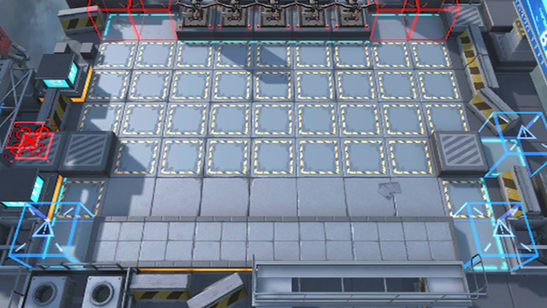

# 关卡一览————VI-4

## 关卡一览

关卡编号: VI-4

关卡名称: 整装列队

目标点生命值: 3

敌人总数: 51

理智消耗: 9

## 关卡地图

## 敌人情况

| 敌人图片 | 敌人名称 | 数量  |
|---------|-----|-----|
| ./eneIcons/eneIcons/¶·Ö¾°ºÑïÎÞÈË»ú.png| 斗志昂扬无人机  |   1  |
| ./eneIcons/eneIcons/ÄàÑÒ¾ÞÏñ.png| 泥岩巨像  |   1  |
| ./eneIcons/eneIcons/ËÞÖ÷Ê¿±ø×鳤.png| 宿主士兵组长  |   20  |
| ./eneIcons/eneIcons/Ìع¤.png| 特工  |   10  |
| ./eneIcons/eneIcons/Ñ°³ðÕß.png| 寻仇者  |   14  |
| ./eneIcons/eneIcons/Óλ÷¶Ó´«Áî±ø.png| 游击队传令兵  |   5  |
