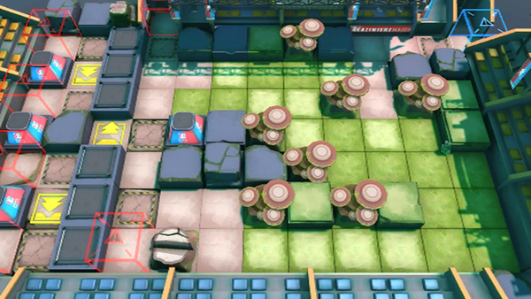

# 关卡一览————VI-7

## 关卡一览

关卡编号: VI-7

关卡名称: 分解和弦

目标点生命值: 5

敌人总数: 73

理智消耗: 18

## 关卡地图

## 敌人情况

| 敌人图片 | 敌人名称 | 数量  |
|---------|-----|-----|
| ./eneIcons/eneIcons/¡°¾Þ´óµÄ³ó¶«Î÷¡±.png| “巨大的丑东西”  |   1  |
| ./eneIcons/eneIcons/°®¹úÕß.png| 爱国者  |   1  |
| ./eneIcons/eneIcons/µòÁãÆïÊ¿.png| 凋零骑士  |   1  |
| ./eneIcons/eneIcons/·ÛËé¹¥¼áÊÖ.png| 粉碎攻坚手  |   3  |
| ./eneIcons/eneIcons/¸¡Ê¿µÂ.png| 浮士德  |   1  |
| ./eneIcons/eneIcons/¸¯°ÜÆïÊ¿.png| 腐败骑士  |   1  |
| ./eneIcons/eneIcons/ºôÐ¥ÆïÊ¿ÍÅѧͽ.png| 呼啸骑士团学徒  |   5  |
| ./eneIcons/eneIcons/ËÞÖ÷Ê¿±ø.png| 宿主士兵  |   16  |
| ./eneIcons/eneIcons/ÌáÑÇ¿¨ÎÚÆÆ»µÕß.png| 提亚卡乌破坏者  |   3  |
| ./eneIcons/eneIcons/ÌáÑÇ¿¨ÎÚսʿ.png| 提亚卡乌战士  |   16  |
| ./eneIcons/eneIcons/Óλ÷¶Ó´«Áî±ø.png| 游击队传令兵  |   4  |
| ./eneIcons/eneIcons/Óλ÷¶Óսʿ.png| 游击队战士  |   21  |
