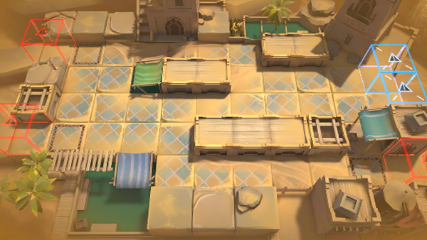

# 关卡一览————WD-1

## 关卡一览

关卡编号: WD-1

关卡名称: 赤角小镇之围

目标点生命值: 5

敌人总数: 49

理智消耗: 12

## 关卡地图

## 敌人情况

| 敌人图片 | 敌人名称 | 数量  |
|---------|-----|-----|
| ./eneIcons/eneIcons/²½±ø.png| 步兵  |   21  |
| ./eneIcons/eneIcons/Õ½ÊõÁÔÈ®.png| 战术猎犬  |   28  |
