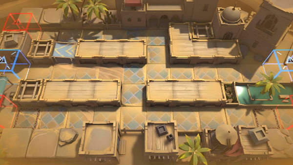

# 关卡一览————WD-4

## 关卡一览

关卡编号: WD-4

关卡名称: 鸣沙阻击战

目标点生命值: 3

敌人总数: 38

理智消耗: 12

## 关卡地图

## 敌人情况

| 敌人图片 | 敌人名称 | 数量  |
|---------|-----|-----|
| ./eneIcons/eneIcons/·´×°¼×²½±ø.png| 反装甲步兵  |   4  |
| ./eneIcons/eneIcons/Ìع¤.png| 特工  |   3  |
| ./eneIcons/eneIcons/Õ½ÊõÁÔÈ®.png| 战术猎犬  |   31  |
