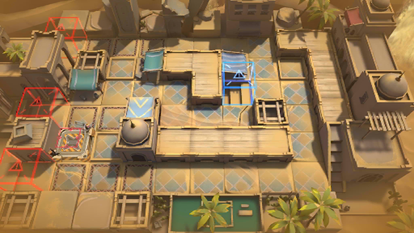

# 关卡一览————WD-5

## 关卡一览

关卡编号: WD-5

关卡名称: 沁礁之地

目标点生命值: 3

敌人总数: 40

理智消耗: 12

## 关卡地图

## 敌人情况

| 敌人图片 | 敌人名称 | 数量  |
|---------|-----|-----|
| ./eneIcons/eneIcons/ÆÆƬ.png| 破片  |   0  |
| ./eneIcons/eneIcons/ÌúÕè.png| 铁砧  |   0  |
| ./eneIcons/eneIcons/Õ½Êõ·ÀÓùÕß.png| 战术防御者  |   4  |
| ./eneIcons/eneIcons/Õ½ÊõÁÔÈ®.png| 战术猎犬  |   30  |
| ./eneIcons/eneIcons/Õ½ÊõåóÊÖ.png| 战术弩手  |   6  |
