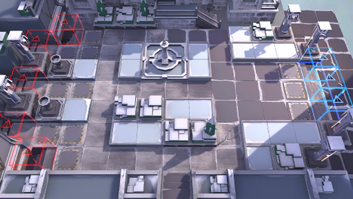

# 关卡一览————WD-8

## 关卡一览

关卡编号: WD-8

关卡名称: 大雪将至

目标点生命值: 3

敌人总数: 31

理智消耗: 18

## 关卡地图

## 敌人情况

| 敌人图片 | 敌人名称 | 数量  |
|---------|-----|-----|
| ./eneIcons/eneIcons/¡°»ÊµÛµÄÀûÈС±£¬×·ÁÔÕß.png| “皇帝的利刃”，追猎者  |   1  |
| ./eneIcons/eneIcons/µÛ¹úÇ°·æ¾«Èñ.png| 帝国前锋精锐  |   4  |
| ./eneIcons/eneIcons/¸ÐȾÕß¾À²ì¹Ù.png| 感染者纠察官  |   18  |
| ./eneIcons/eneIcons/ÎÚÈø˹×ÅîøÊõʦ.png| 乌萨斯着铠术师  |   8  |
