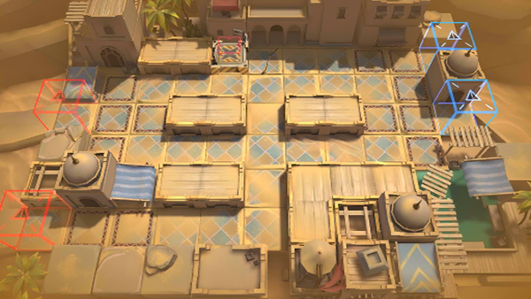

# 关卡一览————WD-EX-2

## 关卡一览

关卡编号: WD-EX-2

关卡名称: 双线协同

目标点生命值: 3

敌人总数: 39

理智消耗: 10

## 关卡地图

## 敌人情况

| 敌人图片 | 敌人名称 | 数量  |
|---------|-----|-----|
| ./eneIcons/eneIcons/»ú¶¯ÎÀ±ø×鳤.png| 机动卫兵组长  |   22  |
| ./eneIcons/eneIcons/ÌúÕèBÐÍ.png| 铁砧B型  |   0  |
| ./eneIcons/eneIcons/Õ½Êõ·ÀÓùÕß×鳤.png| 战术防御者组长  |   4  |
| ./eneIcons/eneIcons/Õ½ÊõÁÔÈ®pro.png| 战术猎犬pro  |   10  |
| ./eneIcons/eneIcons/ÖØ×°·ÀÓùÕß-SÐÍ.png| 重装防御者-S型  |   3  |
