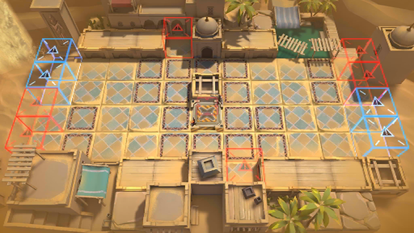

# 关卡一览————WD-EX-5

## 关卡一览

关卡编号: WD-EX-5

关卡名称: 交叉火力支援

目标点生命值: 3

敌人总数: 47

理智消耗: 15

## 关卡地图

## 敌人情况

| 敌人图片 | 敌人名称 | 数量  |
|---------|-----|-----|
| ./eneIcons/eneIcons/·´×°¼×²½±ø.png| 反装甲步兵  |   1  |
| ./eneIcons/eneIcons/·´×°¼×²½±ø×鳤.png| 反装甲步兵组长  |   3  |
| ./eneIcons/eneIcons/ÆÆƬ.png| 破片  |   0  |
| ./eneIcons/eneIcons/ÆÆƬUÐÍ.png| 破片U型  |   0  |
| ./eneIcons/eneIcons/ÌúÕè.png| 铁砧  |   0  |
| ./eneIcons/eneIcons/ÌúÕèBÐÍ.png| 铁砧B型  |   0  |
| ./eneIcons/eneIcons/Õ½Êõ·ÀÓùÕß×鳤.png| 战术防御者组长  |   1  |
| ./eneIcons/eneIcons/Õ½ÊõÁÔÈ®.png| 战术猎犬  |   19  |
| ./eneIcons/eneIcons/Õ½ÊõÁÔÈ®pro.png| 战术猎犬pro  |   16  |
| ./eneIcons/eneIcons/Õ½ÊõåóÊÖ.png| 战术弩手  |   2  |
| ./eneIcons/eneIcons/Õ½ÊõåóÊÖ×鳤.png| 战术弩手组长  |   3  |
| ./eneIcons/eneIcons/Õ½ÕùÓÄÁé.png| 战争幽灵  |   2  |
