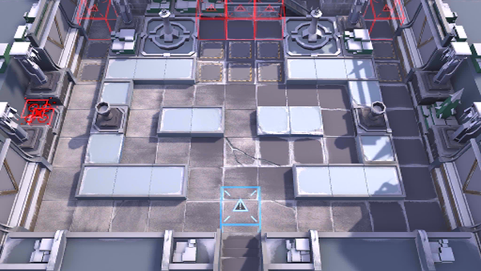

# 关卡一览————WD-EX-8

## 关卡一览

关卡编号: WD-EX-8

关卡名称: 如帝国之影

目标点生命值: 3

敌人总数: 45

理智消耗: 20

## 关卡地图

## 敌人情况

| 敌人图片 | 敌人名称 | 数量  |
|---------|-----|-----|
| ./eneIcons/eneIcons/¡°»ÊµÛµÄÀûÈС±£¬×·ÁÔÕß.png| “皇帝的利刃”，追猎者  |   1  |
| ./eneIcons/eneIcons/µÛ¹úÅÚ»ðÖÐÊàÏÈÕ×Õß.png| 帝国炮火中枢先兆者  |   1  |
| ./eneIcons/eneIcons/µÛ¹úÇ°·æ°ÙÕ½¾«Èñ.png| 帝国前锋百战精锐  |   5  |
| ./eneIcons/eneIcons/µÛ¹úÇ°·æ¾«Èñ.png| 帝国前锋精锐  |   6  |
| ./eneIcons/eneIcons/¸ÐȾÕ߸߼¶¾À²ì¹Ù.png| 感染者高级纠察官  |   9  |
| ./eneIcons/eneIcons/ÎÚÈø˹¸ß¼¶×ÅîøÊõʦ.png| 乌萨斯高级着铠术师  |   3  |
| ./eneIcons/eneIcons/ÎÚÈø˹ÁÑÊÞ×åĸ.png| 乌萨斯裂兽族母  |   20  |
