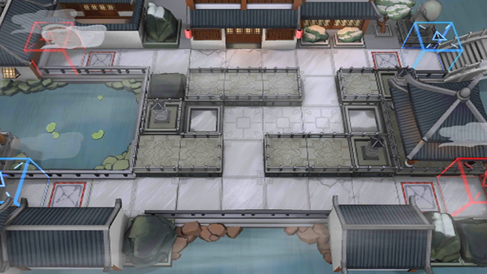

# 关卡一览————WR-1

## 关卡一览

关卡编号: WR-1

关卡名称: 初醒

目标点生命值: 5

敌人总数: 31

理智消耗: 9

## 关卡地图

## 敌人情况

| 敌人图片 | 敌人名称 | 数量  |
|---------|-----|-----|
| ./eneIcons/eneIcons/¡°°¢Ò§¡±.png| “阿咬”  |   16  |
| ./eneIcons/eneIcons/¡°Ð¡Ôꡱ.png| “小躁”  |   15  |
