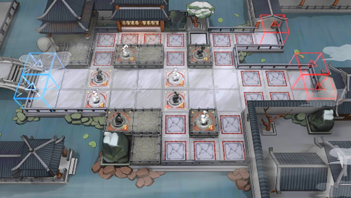

# 关卡一览————WR-4

## 关卡一览

关卡编号: WR-4

关卡名称: 掌柜

目标点生命值: 3

敌人总数: 44

理智消耗: 12

## 关卡地图

## 敌人情况

| 敌人图片 | 敌人名称 | 数量  |
|---------|-----|-----|
| ./eneIcons/eneIcons/¡°°¢Ò§¡±.png| “阿咬”  |   17  |
| ./eneIcons/eneIcons/¡°ÍµÏС±.png| “偷闲”  |   2  |
| ./eneIcons/eneIcons/¡°Ð¡Ôꡱ.png| “小躁”  |   25  |
